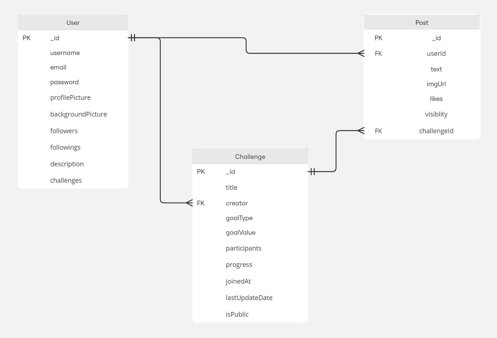

 

## サービスへの想い
1. **継続の後押し**: 自己成長に励む仲間と出会う事ができ、ときに競い、ときに励まし合いモチベーションを保つ。

2. **心理的障壁の低減**: 自己啓発に抵抗を感じる人々に、成長が日常的で自然な活動であることを体感できる。

3. **新たな自分の可能性の発見**: 多様な仲間との交流を通じて、自身の新たな可能性や側面を発見する場になる。

SelfBoostは、これらの要素を通じて、自己成長の喜びと楽しさを広く共有し、互いに支え合いながら成長できる環境を提供します。

 

## 画面プレビュー

 

## 主な機能

1. **ユーザー管理**
   - アカウント登録・ログイン
   - プロフィール編集（ユーザー名、プロフィール画像、背景画像）

2. **チャレンジ機能**
   - 個人チャレンジの作成と管理
   - チャレンジへの参加と進捗追跡
   - 公開/非公開設定
   - おすすめチャレンジの表示

3. **投稿機能**
   - テキストと画像による投稿
   - チャレンジに関連付けた投稿
   - 投稿へのいいね

4. **ソーシャル機能**
   - ユーザーのフォロー/アンフォロー
   - フォロー中ユーザーのタイムライン表示

5. **ダッシュボード**
   - クイックスタッツ（達成したチャレンジ数、進行中のチャレンジ数など）
   - 現在の進捗状況表示

6. **ダークモード**
   - ユーザーの好みに応じたテーマ切り替え

7. **レスポンシブデザイン**
   - モバイルからデスクトップまで、様々なデバイスに対応したUI

 

## 使用技術

| カテゴリ           | 技術スタック                           |
| ----------------- | ------------------------------------  |
| フロントエンド          | JavaScript, React.js, TailwindCSS|
| バックエンド           | Node.js, Express.js               |
| データベース    | MongoDB                                  |
| API通信          |Axios                                   |
| 状態管理       | Ract Context API                          |
| ルーティング | React Router                                |
| 認証             | JSON Web Tokens(JWT)                   |
| 開発環境          | npm                                    |
| バージョン管理     | Git, GitHub                            |

 

## ER図

 
